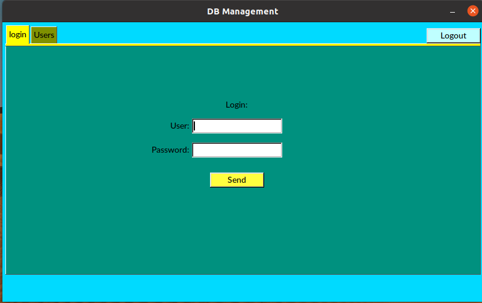
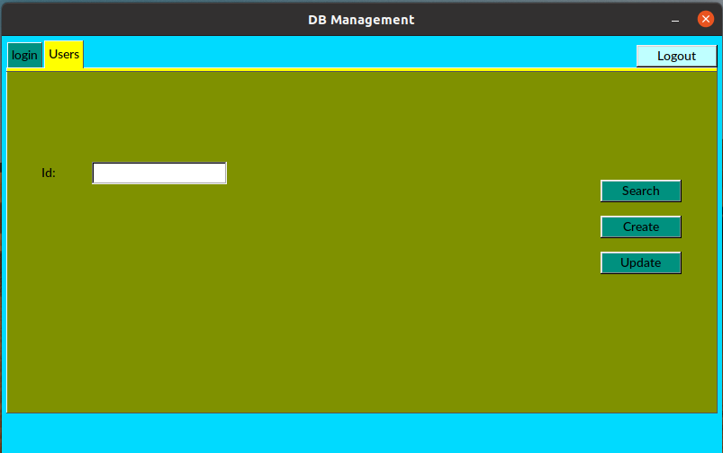
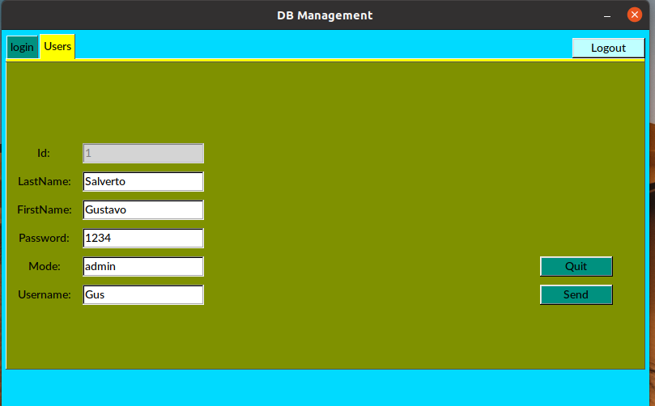

 ******* NOTE: as this project was a training only, I do not maintain it anymore (is not working with conan  2.2.2) ******* 


# Simple App using FLTK and SQLITE3

[](https://opensource.org/licenses/MIT)


## Objetives 
The main purpose of this project is learning how to use [Conan.io](https://conan.io/) (this project follows the tips from [video](https://www.youtube.com/watch?v=i_FGM_rH-Tg&t=7s) by José Tomás Tocino)


System requirements 
libx11-xcb-dev, libfontenc-dev, libxaw7-dev, libxkbfile-dev, libxmu-dev, libxmuu-dev,  libxres-dev, libxtst-dev, libxvmc-dev, libxcb-render-util0-dev, libxcb-xkb-dev, libxcb-icccm4-dev, libxcb-image0-dev, libxcb-keysyms1-dev, libxcb-randr0-dev, libxcb-shape0-dev, libxcb-sync-dev, libxcb-xfixes0-dev, libxcb-xinerama0-dev, libxcb-dri3-dev, libxcb-util-dev,  libxcb-util0-dev,libxcb-xinerama0-dev, libxcb-dri3-dev 

```bash
sudo apt-get install libx11-xcb-dev libfontenc-dev libxaw7-dev libxkbfile-dev libxmu-dev libxmuu-dev  libxres-dev libxtst-dev libxvmc-dev libxcb-render-util0-dev libxcb-xkb-dev libxcb-icccm4-dev libxcb-image0-dev libxcb-keysyms1-dev libxcb-randr0-dev libxcb-shape0-dev libxcb-sync-dev libxcb-xfixes0-dev libxcb-xinerama0-dev libxcb-dri3-dev libxcb-util-dev  libxcb-util0-dev libxcb-xinerama0-dev libxcb-dri3-dev libftgl-dev
```

Download gtest from the repository https://github.com/google/googletest and decompress it inside ./lib/gtest (the released used in this demo is v1.13.0).


Execute
```bash
sudo apt install cmake
pip install conan
source ~/.profile

mkdir build
cd build
conan install ..
cmake
/usr/bin/cmake --build ./ --config Debug --target practica --

```
## Captures




